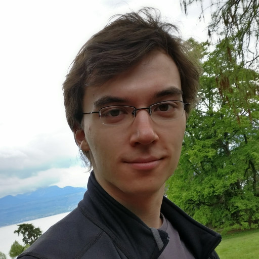

---
---

Hi there!

I'm a PhD student working in the [Dependable Systems Lab](https://dslab.epfl.ch) at [EPFL](https://epfl.ch) on automated verification of software.
One part of my work is making verification more practical, so that developers can use verification techniques in [real-world code](/research/klint).
The other part is showing that making code more verifiable is a desirable goal even outside of verification,
as it is synonymous with improving software design to [make it faster](/research/tinynf) and [safer](/research/tinynf-langs).

I've co-taught EPFL's [Software Engineering](https://github.com/sweng-epfl/public) course,
and the associated [Software Development Project](https://github.com/sweng-epfl/public/tree/main/project) course.

I've also worked on improving the reproducibility of science and on identifying scientific fraud, as you can see in my blog below.

To reach me, see my [EPFL directory page](https://people.epfl.ch/solal.pirelli/?lang=en).

Check out my [research](./research) and my blog below!

_(If you're at EPFL, you may find [my useful things at EPFL doc](./epfl) helpful)_
